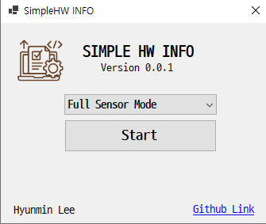
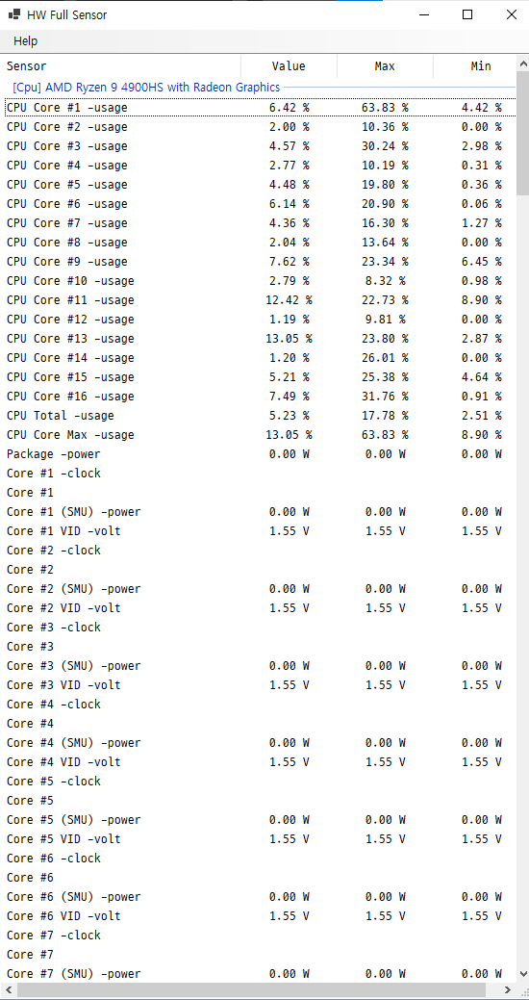
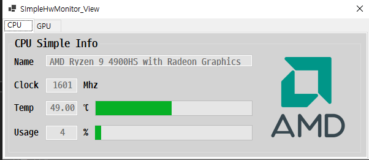
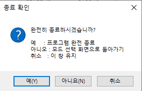

# Simple_Hardware_Info

PC의 하드웨어 상태를 간단하게 모니터링할 수 있는 Windows Forms 기반 데스크탑 애플리케이션입니다.  
`LibreHardwareMonitor` 라이브러리를 이용해 CPU, GPU, 메모리, 네트워크 등의 센서 데이터를 수집하고,  
사용자가 보기 쉬운 두 가지 모드(전체 센서 모드 / 간단 모니터 모드)로 정보를 제공합니다.

---

## 목차

- [1. 프로젝트 개요](#1-프로젝트-개요)
  - [1-1. 기술 스택](#1-1-기술-스택)
- [2. 주요 기능](#2-주요-기능)
  - [2-1. 모드 선택 런처 화면](#2-1-모드-선택-런처-화면)
  - [2-2. Full Sensor Mode (전체 하드웨어)](#2-2-full-sensor-mode-전체-하드웨어)
  - [2-3. Simple Sensor Mode (핵심-하드웨어)](#2-3-simple-sensor-mode-핵심-하드웨어)
  - [2-4. 종료](#2-4-종료)
- [3. 구조](#3-구조)
  - [3-1. MVP 구조](#3-1-mvp-구조)

---

---

## 1. 프로젝트 개요

SimpleHWInfo는 다음과 같은 목적을 가지고 있습니다.

- 복잡한 설정 없이 실행만으로 현재 PC의 하드웨어 정보를 확인할 수 있습니다.
- 전체 하드웨어 정보와 핵심 하드웨어 정보만 보는 두가지 모드를 제공합니다.
- 추후 확장 가능하도록 `MVP 패턴` 기반으로 UI와 데이터 수집 로직을 분리했습니다. 

### 1-1. 기술 스택

- 언어 및 프레임워크
  - C#
  - Windows Forms

- 라이브러리
  - [`LibreHardwareMonitor`](https://github.com/LibreHardwareMonitor/LibreHardwareMonitor) (하드웨어 센서 수집)
  
---

## 2. 주요 기능

### 2-1. 모드 선택 런처 화면

- 프로그램 실행 시 두 모드 중 하나를 선택할 수 있습니다.
  - 'Full Sensor Mode'
  - 'Simple Sensor Mode'

### 2-2. Full Sensor Mode (전체 하드웨어)

- `LibreHardwareMonitor`에서 가져온 하드웨어 센서 값을 `ListView`로 표시합니다.
- 센서 별로 '현재 값 / Min / Max' 컬럼으로 분리하여 한 눈에 보기 편합니다.
- 1초 간격 타이머를 통해 센서 값을 갱신합니다.

### 2-3. Simple Sensor Mode (핵심 하드웨어)

- CPU / GPU에 대한 센서 값을 요약해서 표시합니다.
  - `이름`
  - `클럭`
  - `온도`
  - `사용률`
- 제조사에 따라 다른 아이콘을 표시합니다.

### 2-4. 종료

- 각 모드 화면에서 종료 버튼 클릭 시 다음과 같은 선택지가 있습니다.
  - 프로그램 완전 종료
  - 모드 선택 화면으로 돌아가기
  - 취소  

---
## 3. 구조

### 3-1. MVP 구조

- **HardwareMonitorProvider**
  - LibreHardwareMonitor의 `Computer` 객체를 싱글톤으로 관리합니다.
  - 전체 하드웨어 정보를 스냅샷 모델로 변환해 제공합니다.
  - UI와 무관하게 하드웨어 수집 로직만 담당합니다.

- **HwFullMonitor_Presenter / SimpleHwMonitor_Presenter**
  - `HardwareMonitorProvider`에서 하드웨어 센서 값을 비동기로 가져옵니다.
  - 가져온 하드웨어 센서 값을 View에 제공합니다.
  
- **View 계층 (`*_View` Form)**
  - WinForm 컨트롤 및 화면 표시를 담당합니다.
  - 로직 및 데이터 처리는 Presenter에서만 수행하고, View는 UI 표시와 이벤트만 처리합니다.
  
  ---
  ## 4. TO-DO List
  - 영어 / 한글 지원 예정
  - Setting 버튼을 통해 다양한 설정 지원 예정
  - SimpleSensor 모드에서 SSD / HDD / Ram 추가 예정